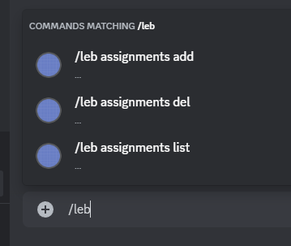
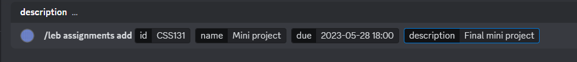
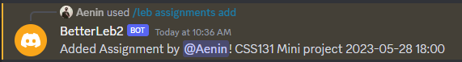
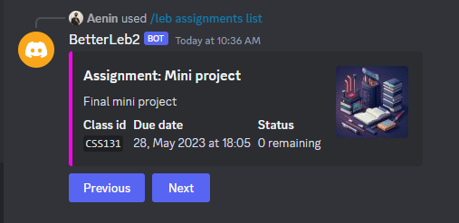
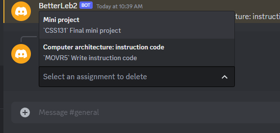
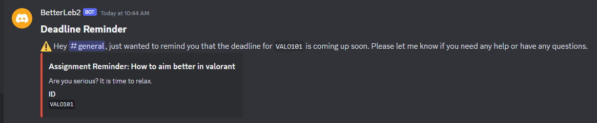

# Better LEB2

Better LEB2 (Learning Environment) is community calendar for students mainly use discord server to share their events and activities. Everyone can use this calendar to remind themselves of any upcoming assignments, exams, or events. This calendar is also a great way to keep track of your daily tasks and events.

## Installation
```cmd
git clone https://github.com/monshinawatra/betterleb2.git
cd betterleb2
pip install -r requirements.txt
```

## Usage
Goto [Discord Developer Portal](https://discord.com/developers/applications) and create a new application. Then, create a bot and copy the token. Edit the `config.py` file and paste the token in the `TOKEN` variable. Then, run the `main.py` file.
```bash
python main.py start_locally
```
`--clean_data` for reset the database 

You can see the list of commands by typing `/leb` in the discord chat. The bot will display all available commands.
<br><br>

<br><br>


<br>You can see the list of all assignments by `/leb assignments list` 



and simply delete the assignmet by `/leb assignments del` and the drop down menu will appear.



Finally betterLeb2 bot will mention the channel when the deadline is upcoming.


## Commands
| Command | Description |
| --- | --- |
| `/leb assignments add <id> <name> <due> <desc>` | Add assignment to database `<due>` should be in YY-MM-DD HH:MM format
| `/leb assignments list` | Show all available assignments
| `/leb assignments del` | Display a drop down menu for delete available assignments
________

<br>

## Future plans
There are many features that I want to add to this bot. However, I don't have enough time to do it. If you want to contribute to this project, feel free to do so. I will be very happy to see this project grow.
- Add more commands
- Voting system for adding events to the calendar (Currently, need approval from the administrator)
- Add bot configuration command
- Schedule reminder with picture.